# Intelligent AI Attendance with Face Recognition

**SmartRoll** is a modern, AI-powered attendance management system that leverages Face Recognition to provide a seamless and secure attendance-tracking experience. Built with Streamlit, Supabase and KNN classifier, it offers dedicated portals for both teachers and students.


## 🚀 Features

### For Teachers
- **Class Management**: Create and manage multiple classes.
- **Attendance Reports**: View and export detailed attendance logs.
- **QR Code Generation**: Generate unique QR codes for students to join classes easily.
- **Manual Overrides**: Ability to manually mark attendance if needed.

### For Students
- **Face Enrollment**: Securely register facial embeddings for recognition.
- **AI-Powered Attendance**: Mark attendance simply by showing your face to the camera.
- **Enrollment Dashboard**: Track enrolled classes and attendance history.

### Core Technology
- **Face Recognition**: Uses `dlib` and `face_recognition` for high-accuracy facial matching.
- **Real-time Database**: Powered by **Supabase** for instant data synchronization.
- **Glassmorphism UI**: A sleek, modern interface built with Streamlit and custom CSS.


## 📊 Database Schema

The system uses a robust relational database structure hosted on Supabase.

[View Database Schema](https://i.ibb.co/8DPPSbxz/supabase-schema-pxjnrmqbfzzoxjyhsebf.png)


## 🧠 Face Recognition Pipeline

The system follows a state-of-the-art deep learning pipeline for face detection and identification.

### 1. Feature Extraction (Embedding Generation)


### 2. Identification Process
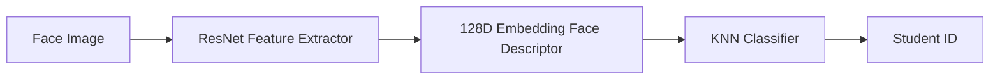


## 🛠️ Tech Stack

- **Frontend**: [Streamlit](https://streamlit.io/)
- **Database**: [Supabase](https://supabase.com/)
- **AI Models**: 
  - Face: `face_recognition` (dlib-based)
- **Backend Logic**: Python
- **Utilities**: `bcrypt` (Hashing), `segno` (QR Codes), `pandas`, `numpy`


## 🚀 Application Workthrough

### 🧑‍🎓 Student Portal
Experience a frictionless academic journey. Students can say goodbye to forgotten passwords—their face is now their key to the classroom.

| Feature | Preview | Description |
|---|---|---|
| 🔐 **FaceID Login** | 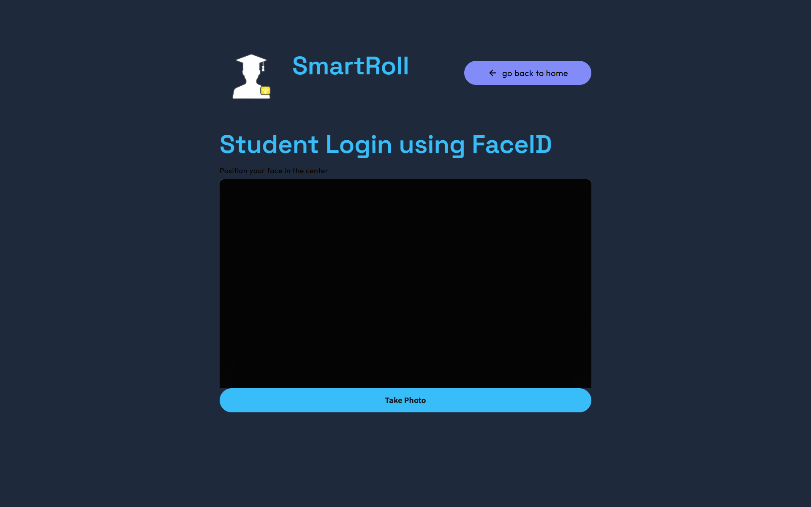 | **Zero-Password Access**: Log in securely using advanced facial recognition. High-speed authentication ensures students are ready for class in seconds. |
| 📸 **Face Registration** | 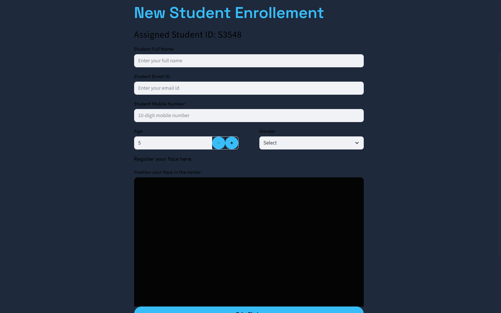 | **One-Time Setup**: Register facial biometric data through a simple guided process. This creates a secure digital identity for all future sessions. |
| 📚 **Student Dashboard** | 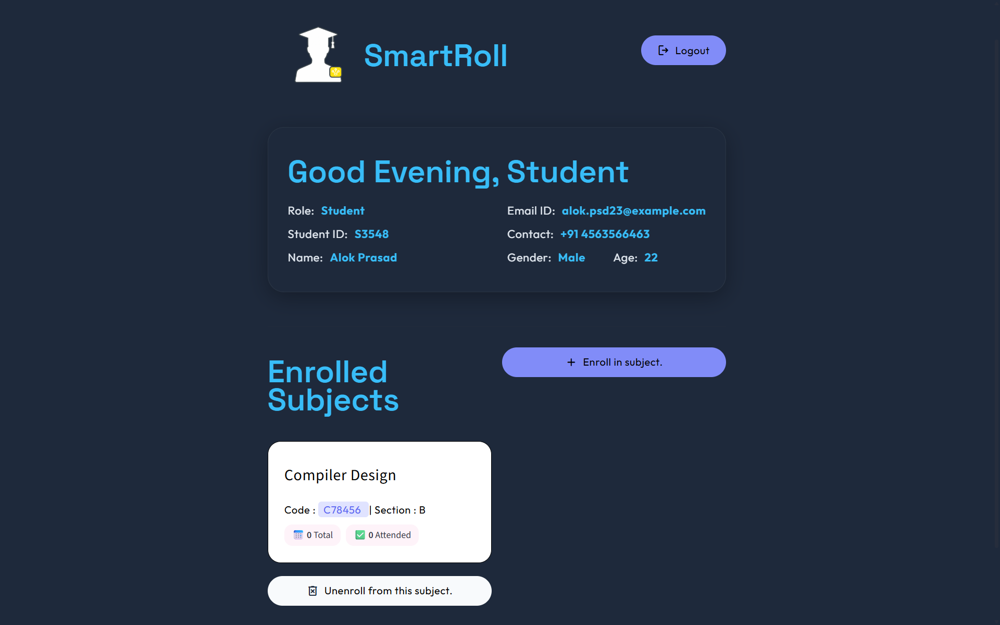 | **Academic Overview**: A personalized hub where students can track enrolled subjects, view attendance history, and manage their profile. |

### 🧑‍🏫 Teacher Portal
Empowering educators with smart tools to manage classrooms and attendance effortlessly.

| Feature | Preview | Description |
|---|---|---|
| 🔐 **Secure Login** | 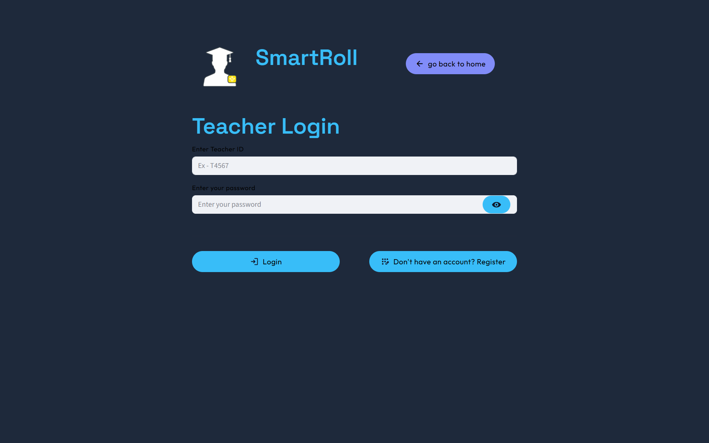 | **Authorized Entry**: Robust authentication for teachers using ID and encrypted passwords to protect sensitive student data. |
| 📝 **Easy Registration** | 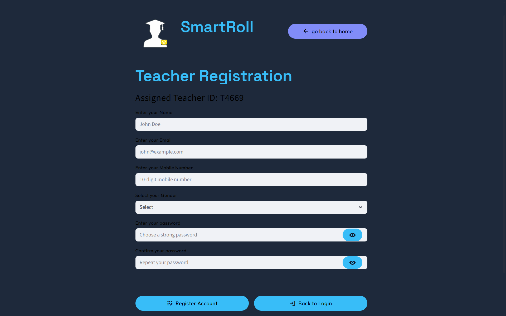 | **Quick Onboarding**: New teachers can join the platform by setting up their academic credentials and personal profiles. |
| 📊 **Admin Dashboard** | 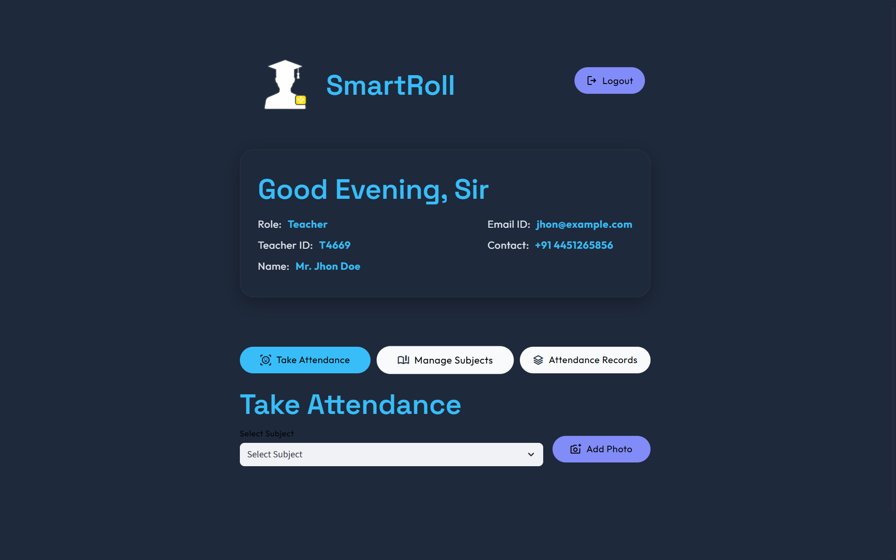 | **Command Center**: A central interface to monitor multiple subjects, view student counts, and trigger AI-powered attendance sessions. |

### 📸 Smart AI Attendance
The core of the system—automating the tedious task of roll calls using state-of-the-art computer vision.

| Feature | Preview | Description |
|---------|---------|-------------|
| 📚 **Session Start** |  | **Seamless Integration**: Select the specific subject and section to initiate an attendance session with a single click. |
| 📸 **Capture/Upload** | 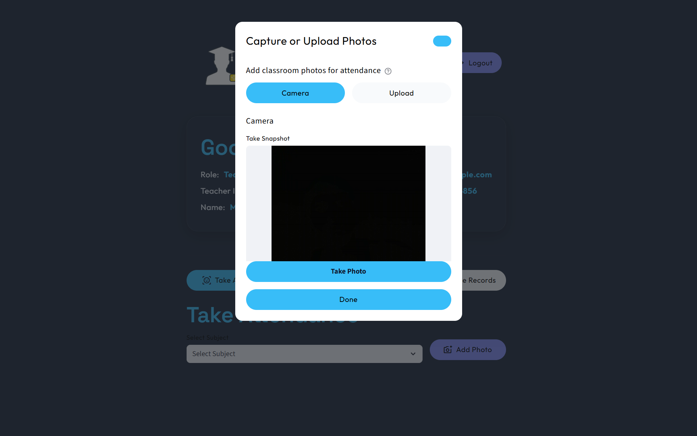 | **Flexible Input**: Use a live camera feed or upload a high-resolution classroom photo. The AI handles group environments with ease. |
| ✅ **AI Verification** | 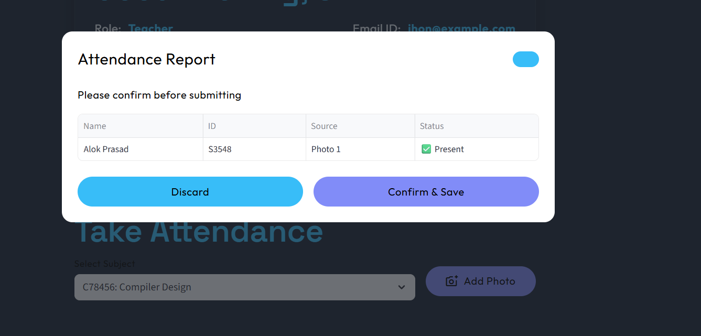 | **Instant Recognition**: The pipeline detects every student in the frame, highlighting recognized faces and flagging unknown individuals for review. |
| 📊 **Records Sync** | 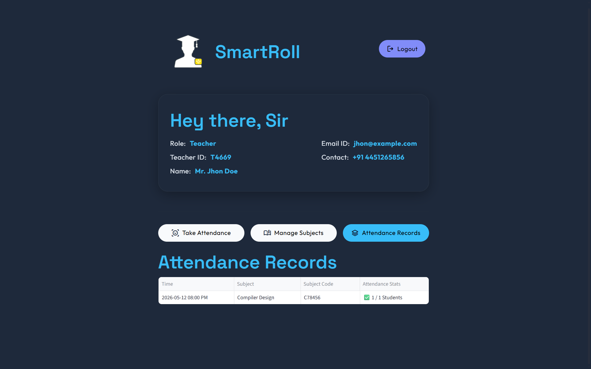 | **Automatic Logging**: Recognized students are instantly marked as 'Present' in the database, creating a reliable and automated attendance trail. |

### 🛠️ Course Management
Streamlined subject administration and student enrollment using modern sharing tools.

| Feature | Preview | Description |
|---------|---------|-------------|
| 📚 **Subject Insights** | 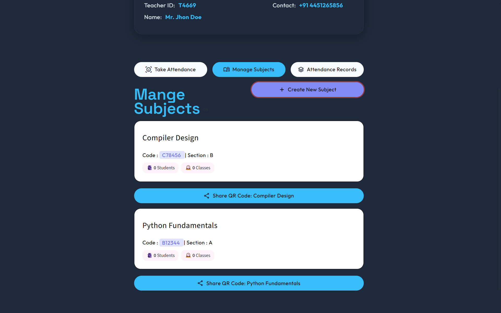 | **Data-Driven View**: Detailed metrics for each subject, including enrollment counts, section identifiers, and historical attendance trends. |
| 📸 **Quick Enrollment** | 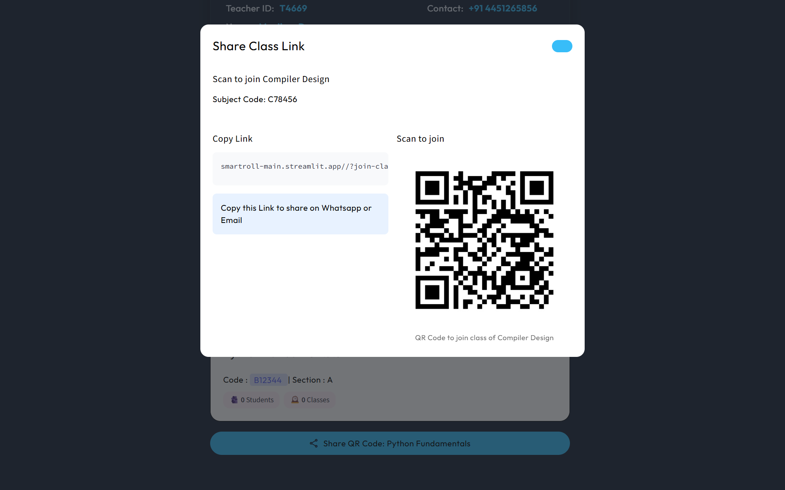 | **Instant Join via QR**: Generate unique QR codes and shareable links. Students can join classes instantly by scanning, eliminating manual entry errors. |

## 📂 Project Structure

```text
├── .streamlit/          # Streamlit configuration & secrets
├── src/
│   ├── components/      # Reusable UI components
│   ├── databases/       # Database connection & queries
│   ├── pipelines/       # AI logic (Face & Voice recognition)
│   ├── screens/         # Page layouts (Home, Teacher, Student)
│   └── ui/              # Custom CSS and styling
├── static/              # Image assets & previews
├── app.py               # Main entry point
├── requirements.txt     # Python dependencies
└── README.md            # Project documentation
```

## ⚙️ Installation & Setup

### 1. Clone the Repository
```bash
git clone https://github.com/your-username/Intelligent-AI-Attendance.git
cd Intelligent-AI-Attendance
```

### 2. Set Up Virtual Environment
```bash
python -m venv .venv
source .venv/bin/activate  # On Windows: .venv\Scripts\activate
```

### 3. Install Dependencies
```bash
pip install -r requirements.txt
```

### 4. Configuration
Create a `.streamlit/secrets.toml` file and add your Supabase credentials:
```toml
SUPABASE_URL = "your_supabase_url"
SUPABASE_KEY = "your_supabase_key"
SUPABASE_PASSW = "your_database_password"
```

### 5. Run the Application
```bash
streamlit run app.py
```


---

## 🛡️ Security
- **Data Privacy**: Facial embeddings are stored as mathematical vectors, not raw images/audio.
- **Authentication**: Secure password hashing using `bcrypt`.

---

## 🤝 Contributing
Contributions are welcome! Please feel free to submit a Pull Request.


